<div align="center">

# 🧬 BioSeq Explorer

### Advanced Computational Biology Workstation

*A fully web-based, interactive genomics platform built in R Shiny — DNA analysis, protein translation, codon optimization, and NCBI/Ensembl integration in one professional IDE.*

[](https://www.r-project.org/)
[](https://shiny.posit.co/)
[](https://www.docker.com/)
[](https://rstudio.github.io/renv/)
[](https://opensource.org/licenses/MIT)

</div>

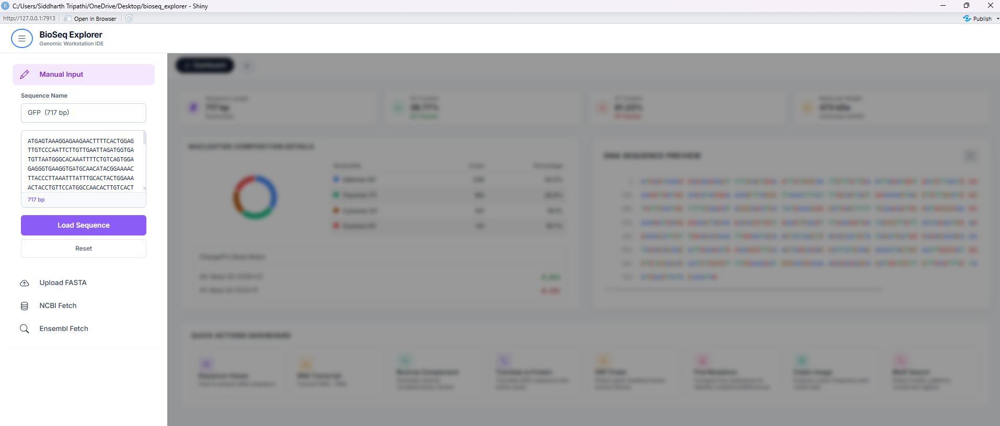

---

## 🎯 Overview

**BioSeq Explorer** is a research-grade bioinformatics workstation that transforms raw DNA sequences into comprehensive biological insights. Built with a Benchling and VSCode-inspired dark theme, it is designed to feel like a professional scientific IDE rather than a generic dashboard.

Developed using R Shiny, the platform incorporates object-oriented programming (R6 classes) for biological sequence manipulation, robust error-handling wrappers, and a highly modular structure. It serves as an interactive environment for genomics, transcriptomics, codon bias diagnostics, and sequence motif/structure analysis.

> **Academic Context**: Designed by a student of systems biology at the *Centre for Systems Biology and Bioinformatics, Panjab University, Chandigarh*.
> 
> 📚 **Researcher Manual**: For a deep scientific dive into the mathematical formulations, biological models, and codebase mapping, read the [Researcher Reference Manual](file:///c:/Users/Siddharth%20Tripathi/OneDrive/Desktop/bioseq_explorer/documentation/researcher_guide.html).

---

## 📂 Project Architecture & Codebase Structure

The workstation uses a coordinated **Model-View-Controller (MVC)** design pattern optimized for R Shiny's reactive dataflow.

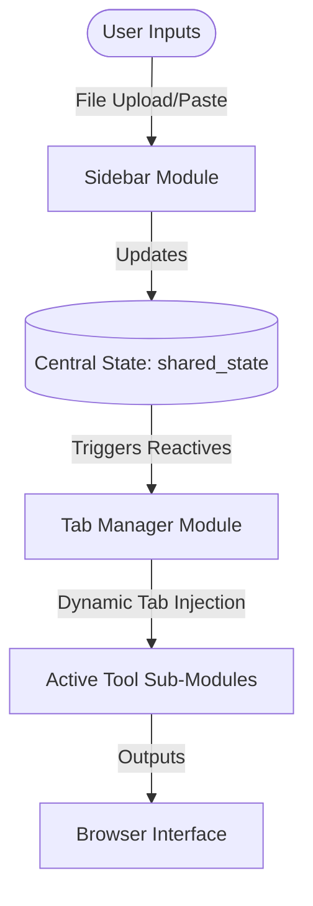

### File Structure Map

*   **[`app.R`](app.R)**: The entry point. Coordinates initialization by sourcing core components.
*   **[`global.R`](global.R)**: The dependency injection layer. Automatically resolves system requirements, loads CRAN/Bioconductor libraries, and sources modules.
*   **[`ui.R`](ui.R)**: Top-level user interface. Implements the collapsible sidebar layout, top navigation bar, and dark mode theme.
*   **[`server.R`](server.R)**: Server coordinator. Pre-loads default biological sequences (such as the Green Fluorescent Protein) and manages the shared reactive workspace state (`shared_state`).
*   **[`bootstrap.R`](bootstrap.R)**: The primary R-session startup loader. Restores packages via `renv.lock` or falls back to `requirements.R`.
*   **[`requirements.R`](requirements.R)**: Core package manager. Automatically checks versions, configures Posit binary mirrors on Linux, and resolves Bioconductor dependencies.
*   **`modules/`**: Core reusable layouts:
    *   `mod_sidebar.R`: Collapsible panel hosting input forms (manual, file upload, NCBI/Ensembl queries).
    *   `mod_tab_manager.R`: Main workspace panel. Manages active tabs, settings synchronization, and dynamic tool rendering.
*   **`utils/`**: Shared infrastructure:
    *   `utils_sequence.R`: High-performance sequence parsing, NCBI Entrez fetches, and biomaRt queries. Implements the **R6 class hierarchy** (`BioSequence`, `DNASequence`, `RNASequence`, `ProteinSequence`).
    *   `safe_runtime.R`: Runtime logging, clean-up operations, and error-catching wrappers.
*   **`tools/`**: Contains the workstation's independent tools.
    *   `registry.R`: Central registry mapping tool IDs to UI/Server modules. Removing or adding a tool requires only a single registry entry.

---

## ✨ Integrated Analytical Engines

BioSeq Explorer includes a suite of 8 analytical tools, each fully modularized into dedicated subdirectories (`tools/tool_name/` containing `ui.R`, `server.R`, and `helpers.R`).

### 1. 👁️ Sequence Viewer
Provides a clear, color-coded view of the loaded DNA sequence for visual scanning.
*   **CpG Island Mapping**: Automatically queries CpG Island datasets from `AnnotationHub` to highlight CG-dense promoter regions.
*   **Composition Statistics**: Tracks A/T/G/C base counts, total sequence length, and overall GC content.
*   **Density Skews**: Renders GC and AT sliding-window skews to reveal replication origins or transcription start sites.

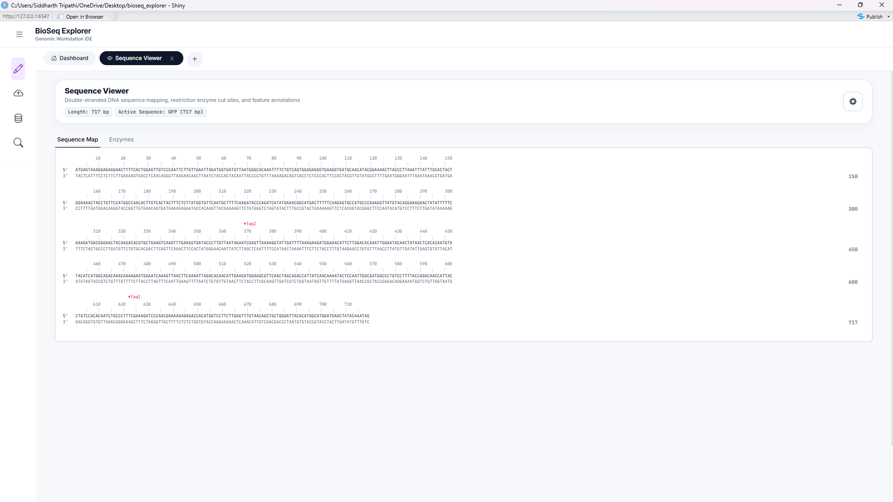

### 2. 🧬 RNA Transcription
Simulates the first step of the central dogma by transcribing DNA to messenger RNA (mRNA).
*   **T → U Conversion**: Maps all Thymine nucleotides to Uracil.
*   **Strand Selection**: Supports direct transcription of the template (anti-sense) or coding (sense) strands.

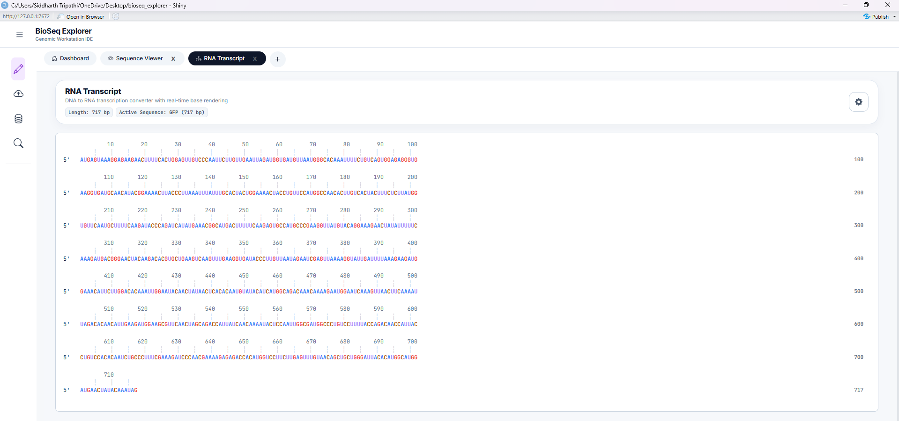

### 3. 🔄 Reverse Complement
Generates the opposite anti-parallel strand of the active DNA sequence.
*   **Molecular Cloning Utility**: Indispensable for designing PCR primers and analyzing reverse-strand open reading frames.
*   **Performance**: Leverages the high-performance C-backend of the `Biostrings` package for instantaneous inversion.

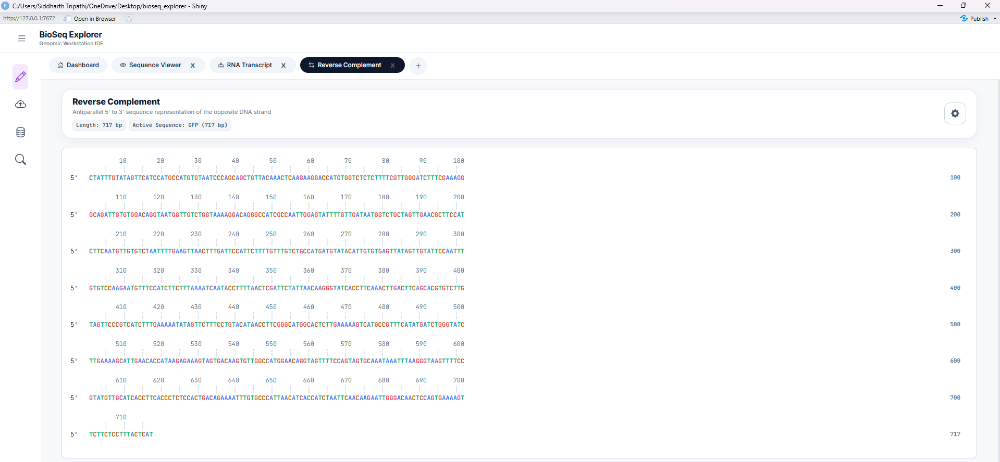

### 4. 🧪 Translate to Protein
Translates DNA or RNA sequences into corresponding amino acid sequences.
*   **Biochemical Classification**: Color-codes amino acids based on physical properties:
    *   🔴 *Acidic* (Aspartate, Glutamate)
    *   🔵 *Basic* (Lysine, Arginine, Histidine)
    *   🟢 *Polar* (Serine, Threonine, Tyrosine, etc.)
    *   🟡 *Non-polar/Hydrophobic* (Alanine, Valine, Leucine, etc.)
    *   ⚫ *Stop Codons* (UAA, UAG, UGA)
*   **Visual Scan**: Simplifies detection of hydrophobic domains or charged surface interfaces.

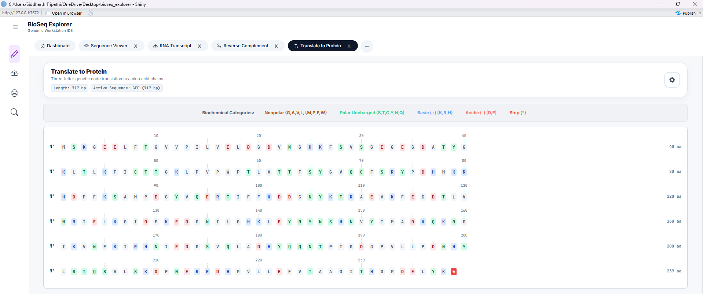

### 5. 🔍 ORF Finder
Identifies potential protein-coding regions within the sequence.
*   **6-Frame Mapping**: Searches three forward and three reverse-complement frames.
*   **Parameters**: Features adjustable start/stop codon definitions and minimum length thresholds (defaulting to a 300 bp standard).

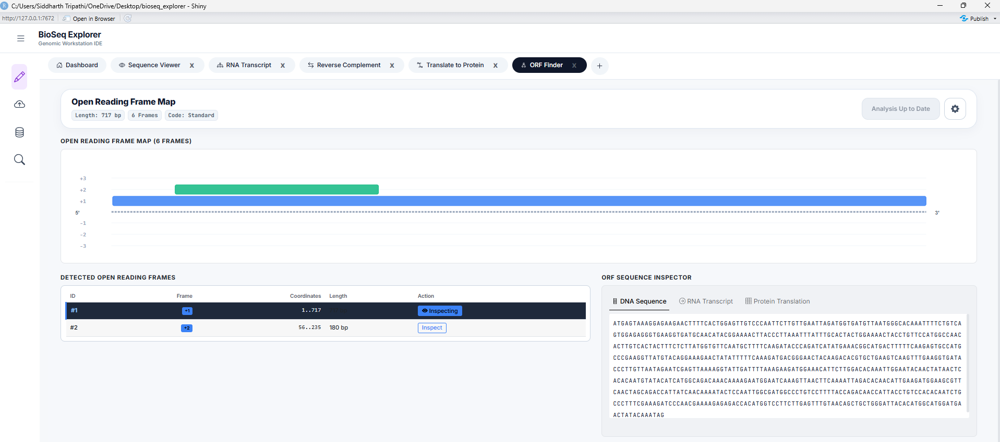

### 6. ⚔️ Mutation Tracker (Variant Finder)
Compares a query sequence against a reference sequence to locate mutations.
*   **Hamming Distance**: Computes simple positional differences for equal-length sequences.
*   **Pairwise Alignment**: Executes global sequence alignments using the Needleman-Wunsch algorithm via the `pwalign` Bioconductor package.
*   **Visual Highlights**: Generates a color-coded alignment diff showcasing substitutions, insertions, and deletions (indels).

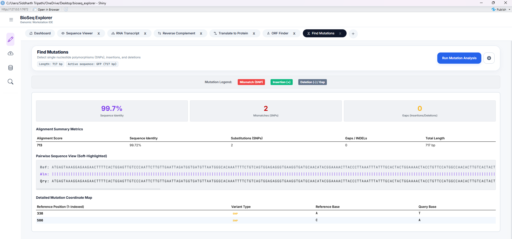

### 7. 📊 Codon Usage & Optimization Studio
An advanced engine evaluating translation efficiency and host compatibility.
*   **Comprehensive Metrics**: Calculates Codon Adaptation Index (CAI), Relative Synonymous Codon Usage (RSCU), Effective Number of Codons (ENC), and tRNA Adaptation Index (tAI).
*   **Visual Diagnostics**:
    *   *ENC-GC3 Plot*: Plots codon bias against GC content at the third position to differentiate selective pressure from mutational bias.
    *   *RSCU Heatmap*: Visualizes comparative codon preferences.
    *   *Sliding Window Graph*: Tracks CAI skews along the open reading frame.
*   **Optimization Studio**: Optimizes sequence codons to maximize expression levels in target hosts (such as *E. coli*, *H. sapiens*, or *S. cerevisiae*) using balanced CAI and GC tuning.

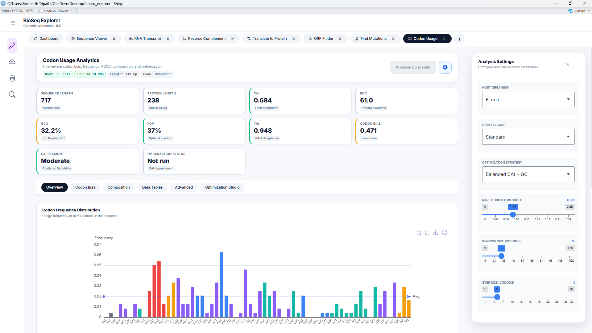
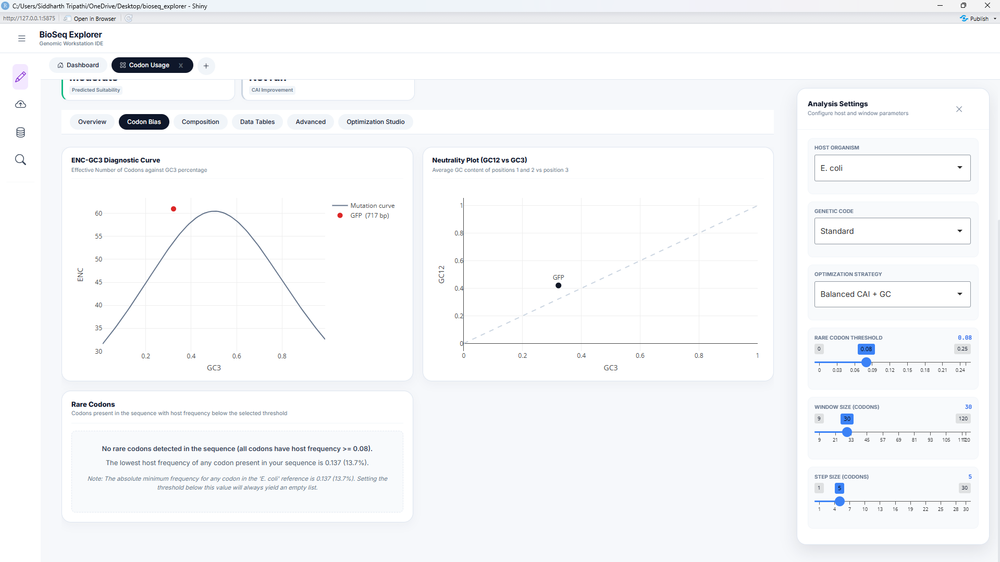
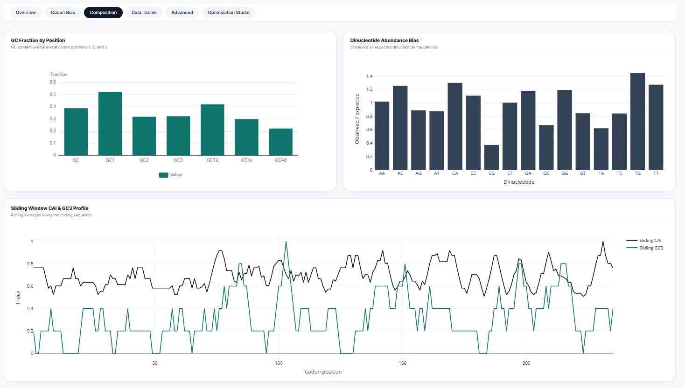
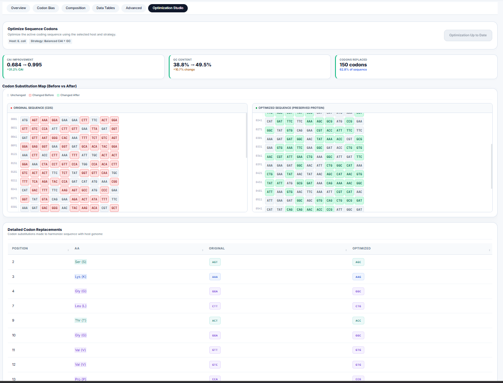

### 8. 🔍 Motif Search & Discovery Workstation
A pattern matching and discovery workbench.
*   **Scanning Engines**: Scans DNA sequences for exact strings, IUPAC degenerate sequences, Regular Expressions (Regex), and Position Weight Matrices (PWM).
*   **De Novo Discovery**: Integrates local k-mer analysis and MEME/STREME APIs to identify unknown conserved motifs.
*   **Structural RNA Analysis**: Predicts stem-loop configurations and minimum free energy (MFE) values for identified motif contexts.
*   **Enrichment Heatmaps**: Renders positional enrichment profiles along the sequence.

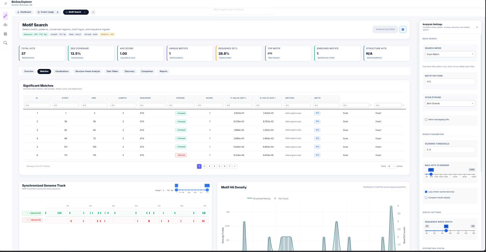
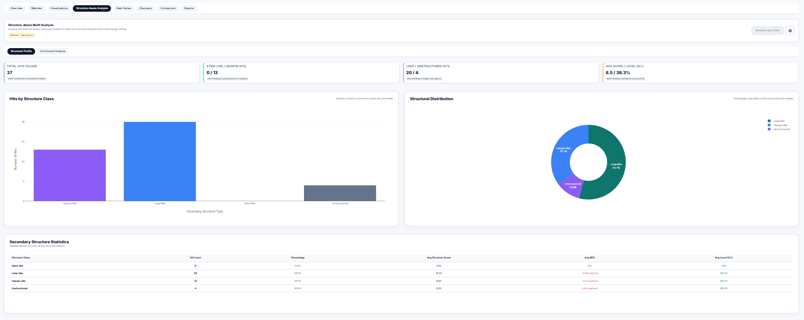
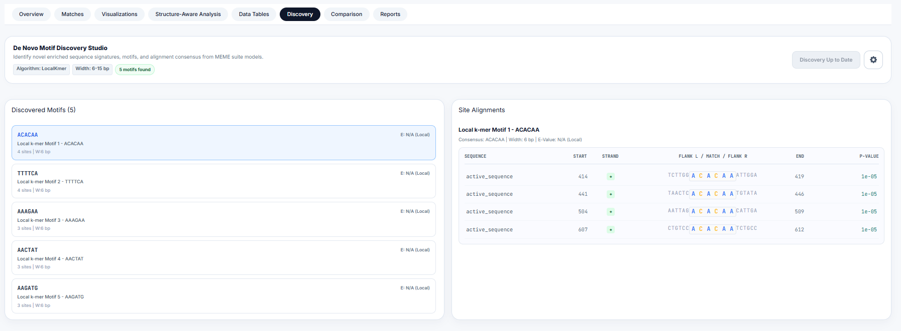
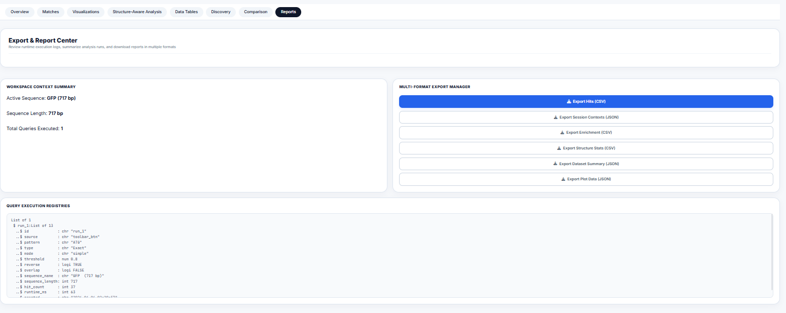

---

## 💻 Technical Stack

*   **UI Framework**: R Shiny + POSIT `bslib` (Bootstrap 5 styling)
*   **State Management**: Shiny `reactiveValues` mapped to session domains
*   **Sequence Manipulation**: `Biostrings` (C-optimized sequence manipulation) and `R6` Object-Oriented classes
*   **Genomics Databases**: `rentrez` (NCBI E-Utilities API), `biomaRt` (Ensembl queries), and `AnnotationHub`
*   **Visualizations**:
    *   `echarts4r` (Apache ECharts R wrapper for high-performance interactive plots)
    *   `plotly` (For 2D/3D scatter and line profiles)
    *   `DT` (DataTables for sorting and filtering raw tables)
    *   `ggseqlogo` (For DNA/Protein sequence logos)
*   **Reproducibility**: Posit `renv` + Posit Package Manager (RSPM) binary integration
*   **Styling**: Custom CSS Grid layouts and Inter & JetBrains Mono typography

---

## 🚀 Getting Started

### 📋 Prerequisites & Compiler Setup

Some bioinformatics packages require a C++ compiler to build from source if precompiled binaries are not available.

*   **Windows**: Install [Rtools](https://cran.r-project.org/bin/windows/Rtools/) and ensure it is added to your system environment variables.
*   **macOS**: Open a terminal and run `xcode-select --install` to set up Xcode Command Line Tools.
*   **Linux (Ubuntu/Debian)**: Install required system headers by running:
    ```bash
    sudo apt-get update && sudo apt-get install -y \
      libcurl4-openssl-dev libssl-dev libxml2-dev libxt-dev zlib1g-dev gfortran make gcc g++
    ```

### 📥 Running the App Locally

The application includes a self-healing bootstrap script that automatically restores packages and starts the server.

1.  **Clone the Repository**:
    ```bash
    git clone https://github.com/yourusername/bioseq_explorer.git
    cd bioseq_explorer
    ```
2.  **Launch via R/RStudio**:
    Open the directory in RStudio or your R terminal and execute:
    ```r
    source("bootstrap.R")
    ```
    This script will:
    *   Verify the existence of the `renv` package manager.
    *   Restore all locked package versions from `renv.lock`.
    *   Launch the app automatically on your localhost at `http://127.0.0.1:3838`.

---

## 🐳 Docker Deployment

To bypass host compiler issues, you can deploy the workstation in an isolated Docker container.

### Using Docker Compose (Recommended)

1.  **Build and Start the Service**:
    ```bash
    docker compose up -d --build
    ```
    *Note: The initial build installs heavy Bioconductor libraries and may take 15–20 minutes. Subsequent startups take less than 10 seconds.*
2.  **Access the IDE**:
    Navigate to `http://localhost:3838` in your browser.
3.  **Shutdown**:
    ```bash
    docker compose down
    ```

### Using Raw Docker Commands

1.  **Build the Image**:
    ```bash
    docker build -t bioseq-explorer .
    ```
2.  **Run the Container**:
    ```bash
    docker run -d -p 3838:3838 --name bioseq_app bioseq-explorer
    ```

---

## 🔌 Developer Guide: Extending the Workstation

Adding a new genomics tool is straightforward thanks to the application's central registry architecture.

### Step 1: Create a Tool Directory
Create a folder under `tools/` (e.g., `tools/gc_skew/`) containing three files:
*   `ui.R`: Define your tool's UI layout function (e.g., `gc_skew_ui <- function(id) { ... }`).
*   `server.R`: Define your tool's server logic function (e.g., `gc_skew_server <- function(id, shared_state) { ... }`).
*   `helpers.R`: Add specialized helper functions or computational logic.

### Step 2: Register the Tool
Open **[`tools/registry.R`](tools/registry.R)** and append your new tool's configuration to the `TOOL_REGISTRY` list:
```r
gc_skew = list(
  id = "gc_skew",
  title = "GC Skew Calculator",
  icon = "graph-up", # Bootstrap icon name
  description = "Analyze GC skews along DNA sequences",
  ui_fun = "gc_skew_ui",
  server_fun = "gc_skew_server"
)
```

### Step 3: Source the Files
Open **[`global.R`](global.R)** and source your files under the tool section:
```r
# TOOL 9: GC Skew Calculator
source("tools/gc_skew/ui.R")
source("tools/gc_skew/server.R")
source("tools/gc_skew/helpers.R")
```
Once sourced, the sidebar and tab manager will automatically detect your configuration, generate the menu item, and route reactive events to your server function when opened.

---

## 📄 License

This project is licensed under the MIT License — see the [LICENSE](LICENSE) file for details. Free to use, modify, and distribute with attribution.
