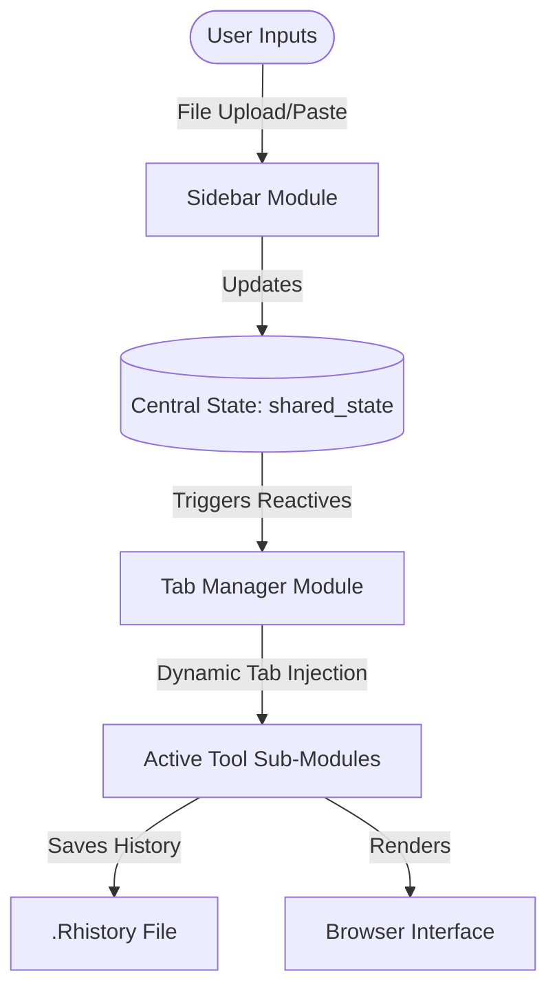

# Codebase Audit: Structure, Architecture, and Performance

This document provides a detailed structural analysis, architectural breakdown, dead-code audit, and performance evaluation of the **BioSeq-Explorer** workstation.

---

## 1. Complete Folder Tree

Below is the directory map of the BioSeq-Explorer codebase after the dead code audit and cleanup:

```text
bioseq_explorer/
├── .Rhistory                             # R console command history
├── BioSeq-Explorer.Rproj                 # RStudio project configuration
├── README.md                             # Main project readme
├── app.R                                 # Application entry point (sources global, ui, server)
├── ui.R                                  # Top-level UI layout (Navbar + Hamburger + Module UI placement)
├── server.R                              # Core server coordinator (loads initial sequence, shares state)
├── global.R                              # Dependency injector (loads R packages and sources code files)
├── requirements.R                        # Package checker & installer (checks versions, runs fallback CRAN/Bioc)
├── bootstrap.R                           # Startup loader (handles renv, calls requirements, launches app)
├── renv/                                 # Renv package manager local files
├── renv.lock                             # Renv lockfile defining exact dependency package versions
├── outputs/                              # Runtime analytical output files
│   └── codon_usage/                      # Cached codon plots and optimization reports
│       ├── ca_clustered.svg, enc_plot.svg, gc_plot.svg, neutrality_plot.svg, oe_dinuc_freq_plot.svg
│       ├── top10_dim1.svg, top10_dim2.svg, variance_explained.svg
│       └── correlation_features_dimensions.csv, gene_features_mean.csv, optimization_changes.csv, optimized_sequence.fasta, rscu_with_ref.csv, significant_features_correlations.csv, total_matrix.csv
├── scratch/                              # Temporary/debugging testing scripts
│   ├── test_responsive_highlights.R, test_shiny_server.R, verify_tests.R
│   └── test_shiny_app.py, trigger_shiny_ws.py
├── examples/                             # Curated sample files for quick loading
│   ├── GFP.fa
│   ├── Homo sapiens insulin (INS).fasta
│   ├── hras.fasta
│   └── Kozak-EGFP.fasta
├── logs/                                 # Runtime application log output folder
│   └── package_install.log
├── www/                                  # Static asset directory (served via shiny::addResourcePath)
│   ├── custom.css                        # Workstation stylesheet (themes, sequence layouts, views)
│   ├── custom.js                         # JS helpers (drawer toggle, download handlers, click listeners)
│   ├── css/                              # Tool-specific stylesheets
│   │   ├── codon-analytics.css
│   │   └── motif-search.css
│   └── js/                               # Responsive resizing JS plugins
│       └── echarts-resize.js
├── modules/                              # Reusable structural Shiny modules
│   ├── mod_footer.R                      # Bottom status bar module (inactive/removed per request)
│   ├── mod_sidebar.R                     # Left collapsible panel module (handles manual, upload, NCBI, Ensembl inputs)
│   └── mod_tab_manager.R                 # Center workstation tabset module (Dashboard home + dynamic tabs)
├── utils/                                # Helper packages and data utilities
│   ├── install_required_packages.R       # Auto-healer for packages called by global.R
│   ├── safe_runtime.R                    # Utility functions (null-coalesce, base counter, clean_dna, logger)
│   └── utils_sequence.R                  # Multi-format parser, NCBI fetch, Ensembl fetch, alignment/primer design engines
└── tools/                                # Tool-specific logic (UI, Server, and Helpers)
    ├── registry.R                        # Centralized registry mapping Tool IDs to UI/Server functions
    ├── sequence_viewer/                  # Tool 1: Zoomable DNA sequence visualizer with CpG island overlay
    │   ├── ui.R, server.R, helpers.R
    ├── rna_transcript/                   # Tool 2: DNA to RNA transcriber (T -> U mapping)
    │   ├── ui.R, server.R, helpers.R
    ├── reverse_complement/               # Tool 3: Bidirectional complement string generator
    │   ├── ui.R, server.R, helpers.R
    ├── translate_protein/                # Tool 4: Triplet codon-to-amino acid translation mapping
    │   ├── ui.R, server.R, helpers.R
    ├── orf_finder/                       # Tool 5: Open Reading Frame 6-frame coordinate mapper
    │   ├── ui.R, server.R, helpers.R
    ├── find_mutations/                   # Tool 6: Sequence comparison alignment tool (Hamming & NW)
    │   ├── ui.R, server.R, helpers.R
    ├── codon_usage/                      # Tool 7: host codon bias analyzer and Optimizer
    │   ├── ui.R, server.R, helpers.R
    │   ├── adapters/                     # Integration modules (UI components, data adapters)
    │   │   ├── adapter_biostrings.R, adapter_cubar.R, adapter_seqinr.R
    │   │   └── codonlib_adapter.R, cubar_adapter.R, seqinr_adapter.R
    │   ├── components/                   # Reusable UI component modules
    │   │   ├── comp_codon_frequency_plot.R, comp_codon_table.R, comp_enc_plot.R, comp_export_panel.R
    │   │   ├── comp_gc_plot.R, comp_host_selector.R, comp_metric_cards.R, comp_neutrality_plot.R
    │   │   └── comp_radar_chart.R, comp_rscu_heatmap.R, comp_sequence_optimizer.R, comp_sliding_window_plot.R
    │   ├── data/                         # Host reference databases
    │   │   └── host_reference/
    │   │       ├── ecoli_reference.rds, human_reference.rds, yeast_reference.rds
    │   ├── engines/                      # Analytical engines
    │   │   ├── engine_cai.R, engine_codon_metrics.R, engine_codon_optimization.R
    │   │   ├── engine_differential_usage.R, engine_enc.R, engine_gc_metrics.R
    │   │   └── engine_rscu.R, engine_sliding_window.R, engine_tai.R, engine_visualization_data.R
    │   └── services/                     # Back-end services
    │       ├── codon_analysis_service.R, codon_optimization_service.R, service_codon_cache.R
    │       └── service_export.R, service_host_reference.R, service_quality_control.R
    └── motif_search/                     # Tool 8: Pattern scanning and de novo discovery (MEME/FIMO/TOMTOM)
        ├── ui.R, server.R, helpers.R, settings.R
        ├── adaptive/                     # UI components for different search modes
        │   ├── adaptive_motif_dashboard.R, adaptive_pwm_profiles.R, adaptive_search_modes.R
        ├── charts/                       # Density plots and visualization wrappers
        │   ├── conserved_region_plot.R, enrichment_chart.R, enrichment_volcano.R, motif_density_plot.R
        │   └── motif_distribution_chart.R, motif_visualizations.R, positional_enrichment_heatmap.R, top_motif_frequency.R
        ├── components/                   # Sub-panel workspace layouts
        │   ├── comp_motif_workspace.R, dataset_summary_panel.R, enrichment_plot.R, motif_alignment_panel.R
        │   └── motif_heatmap.R, motif_logo.R, motif_logo_gallery.R, motif_table.R, pwm_visualizer.R, structure_summary_panel.R
        ├── engines/                      # Local PWM scan matching engine
        │   ├── conserved_region_engine.R, enrichment_engine.R, logo_engine.R, motif_enrichment_engine.R
        │   └── motif_scan_engine.R, motif_structure_analysis.R, motif_variant_engine.R, pwm_engine.R, structure_prediction_engine.R
        └── services/                     # MEME suite cli execution layer and caching service
            ├── meme_suite_service.R, motif_cache_service.R, motif_enrichment_service.R, motif_safety_service.R, motif_search_service.R
```

---

## 2. Architectural Analysis

The application is structured as a **Modular R Shiny Web Application**. It uses a coordinated MVC (Model-View-Controller) design pattern tailored for Shiny:



- **Core Router (`global.R` & `ui.R` / `server.R`)**: Pre-loads packages and sources modules. Sets up a static top navigation layout.
- **Collapsible Sidebar Module (`mod_sidebar.R`)**: Serves as the ingestion zone. It validates sequences as they are typed or uploaded and updates the central reactive list.
- **Central State Manager (`server.R`)**: Employs a unified R Shiny `reactiveValues` list (`shared_state`) that stores the currently active sequence string, metadata, GenBank data, and UI settings. Changes in the sequence string propagate instantly to downstream tools.
- **Central Workstation (`mod_tab_manager.R`)**: Dynamically appends or removes tabs based on registry configs. Slices out sub-environments for tool modules using Shiny's namespacing (`NS`).
- **Tool Registries (`tools/registry.R`)**: Implements the Registry Pattern. Tools register their display titles, icons, and UI/Server string names, removing hardcoded routing dependencies from the layout code.

---

## 3. Dead Code & Unused Assets (Audited & Remediated)

All dead files, folders, and unused dependencies have been successfully removed:

### A. Removed Package Dependencies
- **`ORFik`**: Open Reading Frame detector. The `orf_finder` tool uses a custom R scanning algorithm, so `ORFik` was unused. Removed from `global.R`, `requirements.R`, and `utils/install_required_packages.R` to save startup memory.
- **`openPrimeR`**: Declared as a dependency in `requirements.R` but never loaded or used. Removed from `requirements.R`.

*Note: Other Bioconductor packages (`AnnotationHub`, `biomaRt`, `DECIPHER`, `memes`, and `TFBSTools`) are actively integrated and used by Sequence Viewer, sidebar imports, Mutation Tracker, and Motif Search respectively.*

### B. Deleted Files and Directories
- **`tools/motif_search/1. use this for mortif for production/`**: Full copy of `memes` R package source code (completely dead, deleted).
- **`utils/shared/`**: Contained duplicate R6 classes (`utils_bio_legacy.R`), completely dead, deleted.
- **`tools/registry_commented.R`**: commented-out duplicate of registry, deleted.
- **Empty Placeholder Folders**: `utils/cache/`, `utils/exporters/`, `utils/parsers/`, `utils/validators/` (all deleted).
- **Empty Tool Subdirectories**: `tools/sequence_viewer/engines/`, `tools/motif_search/adapters/`, `tools/motif_search/configs/`, `tools/motif_search/github_integration/`, `tools/motif_search/models/` (all deleted).

---

## 4. Memory Leaks & Reactivity Bottlenecks

The application currently consumes **~2GB of memory**, which is disproportionate to the size of the sequences it processes. This is driven by several systemic leaks and rendering errors:

### A. Non-Teardown Reactives (Reactivity Leak)
When a user closes a tool tab (e.g., Sequence Viewer or RNA Transcript), `mod_tab_manager` removes the tab UI panel, but the server-side output renderers and reactive expressions inside that module **are not destroyed**. 
- Whenever `shared_state$seq_string` updates, **all closed tabs** continue executing their renderers (e.g., character-by-character HTML generation) in the background. 
- Some observers (such as `log_sequence_action` events in `rna_transcript`, `reverse_complement`, and `translate_protein`) are defined outside the cleanup registration `obs_list` and leak memory continuously.

### B. Loop-Based Single-Character HTML Generation (CPU & Memory Hog)
In `tools/sequence_viewer/helpers.R` (`render_double_stranded_sequence`) and `mod_tab_manager.R` (`add_line_nums_simple`), sequence styling is done by splitting the DNA string into a character vector and running an R `vapply` loop over every single base:
- For a sequence of 10,000 bp, this generates **10,000 separate `<span>` HTML tags** in memory.
- Wrapping each base in `<span style="color: ...;">A</span>` multiplies the character footprint by 45x. Sourcing this HTML string on the server and transporting it to the browser freezes the application and leaks R memory quickly.

### C. Nested `reactiveValues` Cycle Danger
In `server.R`, a `reactiveValues` list is placed inside another `reactiveValues` list:
```R
shared_state <- reactiveValues(
  ...
  ui_settings = reactiveValues(...)
)
```
In Shiny, nested `reactiveValues` do not inherit reactivity cleanly and can trigger infinite reactivity loops (where updating a sub-setting triggers evaluations on the parent, which triggers evaluations back on the child).

---

## 5. Accessibility Audit (A11y)

The current user interface suffers from several accessibility issues:

1. **Contrast Violations in Sequence Preview**:
   - The default nucleotide colors (Green for T, Yellow for C on a white preview panel background) fail standard WCAG 2.1 AA/AAA contrast ratios (e.g. Yellow on white is unreadable for low-vision users).
2. **Missing ARIA Roles**:
   - The navigation menu trigger (`#btn_sidebar_toggle`) lacks `aria-expanded` and `aria-controls` properties, making sidebar toggling invisible to screen readers.
3. **Keyboard Navigation (Keyboard Traps & Focus)**:
   - Dynamic tabs generated by `bslib::navset_pill` cannot be navigated, opened, or closed via standard Tab or Arrow key presses.
   - The close buttons (`×`) on tabs are bound to static inline JavaScript clicks instead of keyboard-focusable buttons.
4. **No Structural Headings**:
   - Major pages do not follow a clear semantic hierarchy (e.g., there are multiple `<h6>` cards without parent `<h1>` or `<h2>` headings on the Dashboard page).
