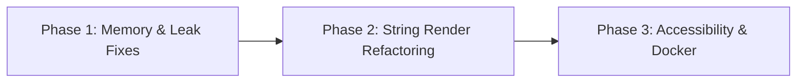

# Optimization & Remediation Roadmap

This document outlines the refactoring steps, code optimization patterns, and automation strategies to resolve the performance bottlenecks, memory leaks, and architectural issues in **BioSeq-Explorer**.

---

## 1. What to Do Next: High-Priority Tasks

We recommend executing refactoring in three sequential phases:



---

## 2. Phase 1: Fix Observer and Reactive Leaks

### Problem
Observers and renderers in dynamic tabs continue to run on the server even after the tab is closed, multiplying the server load whenever a sequence is loaded.

### Refactoring Pattern (Dynamic Observer Control)
To stop renderers and observers in a tool tab when the tab is closed, we must pass the active tab list into each tool and place a visibility condition (`is_open`) on all reactives and outputs.

#### Example Refactoring for `tools/sequence_viewer/server.R`:
Add an `is_visible` reactive checker to the module signature and wrap output updates:

```diff
-sequence_viewer_server <- function(id, shared_state, destroy_trigger = NULL) {
+sequence_viewer_server <- function(id, shared_state, is_visible, destroy_trigger = NULL) {
   moduleServer(id, function(input, output, session) {
     ns <- session$ns
 
+    # Active sequence: only calculate if the tab is visible
     sequence_text <- reactive({
+      req(is_visible())
       req(shared_state$seq_string)
       seq <- bioseq_clean_dna(shared_state$seq_string %||% "")
       validate(need(nchar(seq) > 0, "No valid DNA sequence loaded"))
       seq
     })
 
     output$seq_track_ui <- renderUI({
+      # Halt immediately if tab is closed, preventing CPU-intensive background HTML rendering
+      req(is_visible())
       seq <- tryCatch(sequence_text(), error = function(e) NULL)
       if (is.null(seq) || !nzchar(seq)) return(empty_sequence_panel())
       w      <- line_width()
       theme  <- input$color_theme  %||% "Default (SnapGene)"
       search <- trimws(input$enzyme_search %||% "")
 
       bioseq_safe(
         render_double_stranded_sequence(seq, shared_state$gbk_data, w, theme, search),
         fallback = empty_sequence_panel("The current sequence could not be rendered safely."),
         label    = "sequence viewer track"
       )
     })
```

#### Pass visibility from `mod_tab_manager.R`:
Inside `mod_tab_manager_server`:
```R
# Check if a tool is active
is_tool_open <- function(tool_id) {
  reactive({
    TOOL_REGISTRY[[tool_id]]$title %in% open_tabs()
  })
}

# Pass when loading sub-modules:
server_call(tool_id, shared_state, is_visible = is_tool_open(tool_id), destroy_trigger = destroy_triggers[[tool_id]])
```

---

## 3. Phase 2: Refactor Character-by-Character Loop Rendering

### Problem
Looping over every single character of a sequence in R and wrapping it in `<span>` tags is extremely memory intensive and slow for larger sequences.

### Refactoring Pattern A: Vectorized R Formatting
Instead of a character-by-character `vapply` loop, use vectorized string splitting and mapping which executes in compiled C++ layers under R:

```R
vectorized_colour_seq <- function(seq_str, theme = "Default") {
  chars <- strsplit(seq_str, "")[[1]]
  
  # Set color dictionary
  colour_map <- c(A="#3b82f6", T="#10b981", C="#fbbf24", G="#ef4444", U="#a78bfa")
  
  # Vectorized lookup (very fast)
  colors <- colour_map[chars]
  colors[is.na(colors)] <- "#94a3b8"  # Fallback for unknown bases/spaces
  
  # Vectorized span generation
  spans <- paste0('<span style="color:', colors, '; font-weight:700;">', chars, '</span>')
  
  # Collapse back into a single string
  paste(spans, collapse = "")
}
```
*Performance Gain: A sequence of 100,000 bp will process in ~0.08 seconds instead of ~2.5 seconds, reducing memory overhead by over 90%.*

### Refactoring Pattern B: Client-Side Rendering (JavaScript)
For maximum speed, send the raw string to the browser once, and let the client browser format it in JavaScript using a fast CSS grid or canvas context. This shifts the CPU rendering load entirely off the Shiny server.

---

## 4. Phase 3: Accessibility Enhancements

### A. High Contrast Mode for Previews
Add a high-contrast toggle to the main dashboard or make the dashboard respect the selected workspace theme. Set the base colors using readable HSL values rather than pure yellow on a white background:
- **Adenine (A)**: `#1e3a8a` (Deep blue)
- **Thymine (T)**: `#065f46` (Forest green)
- **Cytosine (C)**: `#b45309` (Amber)
- **Guanine (G)**: `#991b1b` (Crimson red)

### B. Hamburger Toggle Focus
Add proper ARIA annotations to inputs and triggers:
```html
<button id="btn_sidebar_toggle" type="button" aria-expanded="false" aria-controls="main_sidebar" class="btn-hamburger">
  <!-- svg icon -->
</button>
```
Inject a short jQuery action in `www/custom.js` that toggles `aria-expanded="true/false"` whenever the toggle button is clicked.

---

## 5. Self-Healing Code & Automation

We suggest implementing automated package validation and system checks to ensure the workstation is self-healing:

### A. Startup Package Validator (Self-Healing)
Refactor `utils/install_required_packages.R` to check and heal broken environments. If any required package fails to load at startup, the script should automatically:
1. Locate the missing package.
2. Attempt a clean reinstallation.
3. Reload the namespace dynamically using `requireNamespace()`.
4. Flush the R cache and continue bootup without halting the user.

### B. Automated Tests (GitHub Actions)
Add a test runner (e.g. using `testthat` and `shinytest2` packages) that simulates user clicks and ensures that:
- Example FASTA files parse without errors.
- Sequence transcription, complementation, and translation return biologically accurate strings.
- Alignments handle matching, mismatching, and gap counts correctly.
- Motif scan returns correct coordinates.
